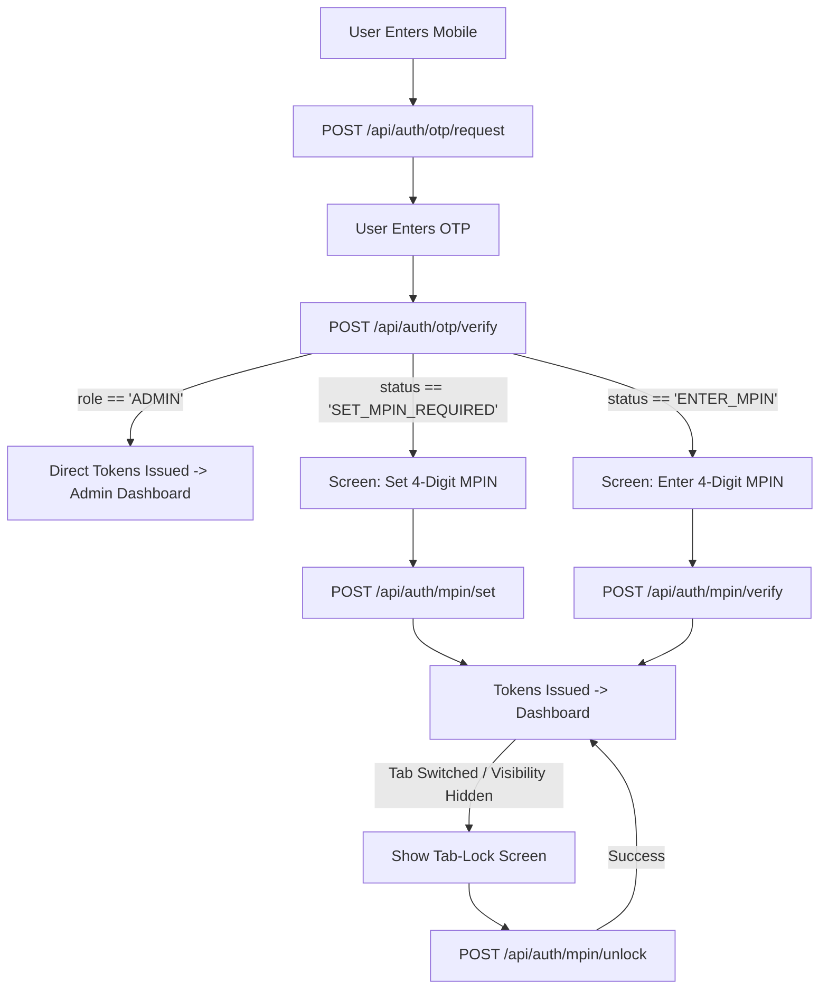

# Vistora Frontend Authentication Integration Guide

> **Target Audience:** Frontend AI Agent / React Developer  
> **Backend Base URL:** `http://localhost:5000`  
> **Auth Base Route:** `http://localhost:5000/api/auth`  
> **Default Headers:** `Content-Type: application/json`

---

## 📌 1. Architecture & Design Principles

The Vistora backend implements a **custom OTP + MPIN authentication system** (no passwords):
1. **Identity Proof (OTP):** Mobile number ownership is verified via a 6-digit OTP (5-digit for Admin).
2. **Day-to-Day PIN (MPIN):** Fast 4-digit unlock PIN used for login after OTP verification.
3. **Session Management (JWT):** Short-lived **15-minute Access Token** (sent in `Authorization: Bearer <token>` header) + **7-day Refresh Token** (for silent token rotation).
4. **Soft Tab-Lock:** When a logged-in user switches browser tabs, the frontend locks and displays an MPIN unlock overlay without killing the active session tokens.
5. **Role-Based Access Control (RBAC):** `GUEST`, `HOST`, and `ADMIN`.

---

## 🔑 2. Fixed Development OTPs & Credentials

In development mode, OTPs are fixed and logged to the backend terminal:

| Role | Test Mobile | Dev OTP | MPIN Behavior |
|---|---|---|---|
| **GUEST** | `9811002201` (or self-registered) | `999999` (6 digits) | Sets 4-digit MPIN on first login |
| **HOST** | `9822003301` (or self-registered) | `118899` (6 digits) | Sets 4-digit MPIN on first login |
| **ADMIN** | `9000000000` (pre-seeded) | `55555` (5 digits) | **No MPIN** — direct login on OTP verification |

---

## 🗺️ 3. Complete User Journeys & State Machine



---

## 📡 4. Complete API Specifications

### 4.1 Register (`POST /api/auth/register`)
Creates a new `GUEST` or `HOST` user (`is_verified = false`, `mpin_hash = null`).  
*(Note: Admin cannot self-register).*

- **Endpoint:** `POST /api/auth/register`
- **Request Body:**
```json
{
  "name": "Sameer Guest",
  "email": "sameer.guest@example.com",
  "mobile": "9811002201",
  "role": "GUEST" // "GUEST" | "HOST"
}
```
- **Response `201 Created`:**
```json
{
  "message": "User registered successfully",
  "user": {
    "id": 4,
    "name": "Sameer Guest",
    "email": "sameer.guest@example.com",
    "mobile": "9811002201",
    "role": "GUEST",
    "is_verified": false,
    "created_at": "2026-08-23T15:20:00.000Z"
  }
}
```

---

### 4.2 Request OTP (`POST /api/auth/otp/request`)
Triggers OTP dispatch for a mobile number.

- **Endpoint:** `POST /api/auth/otp/request`
- **Request Body:**
```json
{
  "mobile": "9811002201"
}
```
- **Response `200 OK`:**
```json
{
  "message": "OTP sent successfully",
  "otpSent": true,
  "role": "GUEST" // "GUEST" | "HOST" | "ADMIN"
}
```

---

### 4.3 Verify OTP (`POST /api/auth/otp/verify`)
Verifies OTP and marks `is_verified = true`.

- **Endpoint:** `POST /api/auth/otp/verify`
- **Request Body:**
```json
{
  "mobile": "9811002201",
  "otp": "999999"
}
```

#### Case A: First-time Guest / Host (MPIN not set yet)
- **Response `200 OK`:**
```json
{
  "message": "OTP verified successfully",
  "status": "SET_MPIN_REQUIRED",
  "otpTicket": "eyJhbGciOiJIUzI1NiIsInR5cCI6IkpXVCJ9..."
}
```
👉 *Frontend action: Store `otpTicket` in memory and navigate user to `<SetMpinScreen />`.*

#### Case B: Returning Guest / Host (MPIN already set)
- **Response `200 OK`:**
```json
{
  "message": "OTP verified successfully",
  "status": "ENTER_MPIN",
  "otpTicket": "eyJhbGciOiJIUzI1NiIsInR5cCI6IkpXVCJ9..."
}
```
👉 *Frontend action: Store `otpTicket` in memory and navigate user to `<EnterMpinScreen />`.*

#### Case C: Admin (No MPIN required)
- **Response `200 OK`:**
```json
{
  "message": "OTP verified successfully",
  "role": "ADMIN",
  "user": {
    "id": 5,
    "name": "Vistora Admin",
    "email": "admin@vistora.com",
    "mobile": "9000000000",
    "role": "ADMIN",
    "is_verified": true,
    "created_at": "2026-08-23T15:20:00.000Z"
  },
  "accessToken": "eyJhbGciOiJIUzI1NiIsInR5cCI6IkpXVCJ9...",
  "refreshToken": "eyJhbGciOiJIUzI1NiIsInR5cCI6IkpXVCJ9..."
}
```
👉 *Frontend action: Store tokens, set `user` in AuthContext, navigate directly to `/admin`.*

---

### 4.4 Set First-Time MPIN (`POST /api/auth/mpin/set`)
Hashes 4-digit MPIN and issues initial Access + Refresh tokens.

- **Endpoint:** `POST /api/auth/mpin/set`
- **Request Body:**
```json
{
  "mobile": "9811002201",
  "otpTicket": "eyJhbGciOiJIUzI1NiIsInR5cCI6IkpXVCJ9...",
  "mpin": "1234" // Exactly 4 digits
}
```
- **Response `200 OK`:**
```json
{
  "message": "MPIN set successfully",
  "user": {
    "id": 4,
    "name": "Sameer Guest",
    "email": "sameer.guest@example.com",
    "mobile": "9811002201",
    "role": "GUEST",
    "is_verified": true,
    "created_at": "2026-08-23T15:20:00.000Z"
  },
  "accessToken": "eyJhbGciOiJIUzI1NiIsInR5cCI6IkpXVCJ9...",
  "refreshToken": "eyJhbGciOiJIUzI1NiIsInR5cCI6IkpXVCJ9..."
}
```

---

### 4.5 Returning Login with MPIN (`POST /api/auth/mpin/verify`)
Authenticates returning user via MPIN and issues Access + Refresh tokens.

- **Endpoint:** `POST /api/auth/mpin/verify`
- **Request Body:**
```json
{
  "mobile": "9811002201",
  "otpTicket": "eyJhbGciOiJIUzI1NiIsInR5cCI6IkpXVCJ9...",
  "mpin": "1234" // Exactly 4 digits
}
```
- **Response `200 OK`:**
```json
{
  "message": "Login successful",
  "user": {
    "id": 4,
    "name": "Sameer Guest",
    "email": "sameer.guest@example.com",
    "mobile": "9811002201",
    "role": "GUEST",
    "is_verified": true,
    "created_at": "2026-08-23T15:20:00.000Z"
  },
  "accessToken": "eyJhbGciOiJIUzI1NiIsInR5cCI6IkpXVCJ9...",
  "refreshToken": "eyJhbGciOiJIUzI1NiIsInR5cCI6IkpXVCJ9..."
}
```

---

### 4.6 Refresh Access Token (`POST /api/auth/refresh`)
Generates a new 15-minute Access Token when the existing one expires.

- **Endpoint:** `POST /api/auth/refresh`
- **Request Body:**
```json
{
  "refreshToken": "eyJhbGciOiJIUzI1NiIsInR5cCI6IkpXVCJ9..."
}
```
- **Response `200 OK`:**
```json
{
  "message": "Token refreshed successfully",
  "accessToken": "eyJhbGciOiJIUzI1NiIsInR5cCI6IkpXVCJ9..."
}
```

---

### 4.7 MPIN Tab-Lock Unlock (`POST /api/auth/mpin/unlock`)
Unlocks the UI overlay when user returns to the tab. **No new tokens are generated.**

- **Endpoint:** `POST /api/auth/mpin/unlock`
- **Headers:**
  ```http
  Authorization: Bearer <accessToken>
  ```
- **Request Body:**
```json
{
  "mpin": "1234"
}
```
- **Response `200 OK`:**
```json
{
  "message": "Unlocked successfully",
  "unlocked": true
}
```

---

### 4.8 Logout (`POST /api/auth/logout`)
Revokes refresh token from database.

- **Endpoint:** `POST /api/auth/logout`
- **Request Body:**
```json
{
  "refreshToken": "eyJhbGciOiJIUzI1NiIsInR5cCI6IkpXVCJ9..."
}
```
- **Response `200 OK`:**
```json
{
  "message": "Logged out successfully",
  "loggedOut": true
}
```

---

## 💻 5. Frontend Implementation Blueprint (React + TypeScript)

### 5.1 TypeScript Types (`src/types/auth.types.ts`)

```typescript
export type Role = 'GUEST' | 'HOST' | 'ADMIN';

export interface User {
  id: number;
  name: string;
  email: string;
  mobile: string;
  role: Role;
  is_verified: boolean;
  created_at: string;
}

export interface RegisterPayload {
  name: string;
  email: string;
  mobile: string;
  role: 'GUEST' | 'HOST';
}

export interface OtpRequestPayload {
  mobile: string;
}

export interface OtpVerifyPayload {
  mobile: string;
  otp: string;
}

export interface OtpVerifyResponse {
  message: string;
  status?: 'SET_MPIN_REQUIRED' | 'ENTER_MPIN';
  otpTicket?: string;
  role?: Role;
  user?: User;
  accessToken?: string;
  refreshToken?: string;
}

export interface MpinPayload {
  mobile: string;
  otpTicket: string;
  mpin: string;
}

export interface AuthSuccessResponse {
  message: string;
  user: User;
  accessToken: string;
  refreshToken: string;
}
```

---

### 5.2 Axios Client with Silent 401 Refresh Interceptor (`src/api/client.ts`)

```typescript
import axios from 'axios';

const api = axios.create({
  baseURL: 'http://localhost:5000/api',
  headers: {
    'Content-Type': 'application/json',
  },
});

// Attach Access Token to every request
api.interceptors.request.use((config) => {
  const token = localStorage.getItem('accessToken');
  if (token && config.headers) {
    config.headers.Authorization = `Bearer ${token}`;
  }
  return config;
});

// Handle Token Expiry & Silent Refresh
let isRefreshing = false;
let failedQueue: Array<{
  resolve: (value?: unknown) => void;
  reject: (reason?: unknown) => void;
}> = [];

const processQueue = (error: unknown, token: string | null = null) => {
  failedQueue.forEach((prom) => {
    if (error) {
      prom.reject(error);
    } else {
      prom.resolve(token);
    }
  });
  failedQueue = [];
};

api.interceptors.response.use(
  (response) => response,
  async (error) => {
    const originalRequest = error.config;

    if (error.response?.status === 401 && !originalRequest._retry) {
      if (originalRequest.url === '/auth/refresh') {
        localStorage.clear();
        window.location.href = '/login';
        return Promise.reject(error);
      }

      if (isRefreshing) {
        return new Promise((resolve, reject) => {
          failedQueue.push({ resolve, reject });
        })
          .then((token) => {
            originalRequest.headers.Authorization = `Bearer ${token}`;
            return api(originalRequest);
          })
          .catch((err) => Promise.reject(err));
      }

      originalRequest._retry = true;
      isRefreshing = true;

      const refreshToken = localStorage.getItem('refreshToken');
      if (!refreshToken) {
        localStorage.clear();
        window.location.href = '/login';
        return Promise.reject(error);
      }

      try {
        const { data } = await axios.post('http://localhost:5000/api/auth/refresh', {
          refreshToken,
        });

        const newAccessToken = data.accessToken;
        localStorage.setItem('accessToken', newAccessToken);
        api.defaults.headers.common['Authorization'] = `Bearer ${newAccessToken}`;

        processQueue(null, newAccessToken);
        return api(originalRequest);
      } catch (refreshErr) {
        processQueue(refreshErr, null);
        localStorage.clear();
        window.location.href = '/login';
        return Promise.reject(refreshErr);
      } finally {
        isRefreshing = false;
      }
    }

    return Promise.reject(error);
  }
);

export default api;
```

---

### 5.3 Tab-Lock Hook (`src/hooks/useTabLock.ts`)

```typescript
import { useState, useEffect } from 'react';

export function useTabLock(isAuthenticated: boolean, role?: string) {
  const [isLocked, setIsLocked] = useState(false);
  const [wasHidden, setWasHidden] = useState(false);

  useEffect(() => {
    // Admin is exempted from tab-lock per PRD
    if (!isAuthenticated || role === 'ADMIN') return;

    const handleVisibilityChange = () => {
      if (document.visibilityState === 'hidden') {
        setWasHidden(true);
      } else if (document.visibilityState === 'visible' && wasHidden) {
        setIsLocked(true);
      }
    };

    document.addEventListener('visibilitychange', handleVisibilityChange);
    return () => document.removeEventListener('visibilitychange', handleVisibilityChange);
  }, [isAuthenticated, role, wasHidden]);

  const unlock = () => {
    setIsLocked(false);
    setWasHidden(false);
  };

  return { isLocked, unlock };
}
```

---

### 5.4 Tab-Lock Screen Overlay Component (`src/components/TabLockModal.tsx`)

```tsx
import React, { useState } from 'react';
import api from '../api/client';

interface Props {
  onUnlocked: () => void;
  onLogout: () => void;
}

export const TabLockModal: React.FC<Props> = ({ onUnlocked, onLogout }) => {
  const [mpin, setMpin] = useState('');
  const [error, setError] = useState('');
  const [loading, setLoading] = useState(false);

  const handleUnlock = async (e: React.FormEvent) => {
    e.preventDefault();
    if (mpin.length !== 4) {
      setError('Please enter your 4-digit MPIN');
      return;
    }

    setLoading(true);
    setError('');

    try {
      await api.post('/auth/mpin/unlock', { mpin });
      onUnlocked();
    } catch (err: any) {
      setError(err.response?.data?.message || 'Invalid MPIN');
    } finally {
      setLoading(false);
    }
  };

  return (
    <div className="fixed inset-0 z-50 flex items-center justify-center bg-black/80 backdrop-blur-md">
      <div className="w-full max-w-sm rounded-2xl bg-white p-6 shadow-2xl text-center">
        <h2 className="text-xl font-bold text-gray-900">🔒 Screen Locked</h2>
        <p className="mt-1 text-sm text-gray-500">Enter your 4-digit MPIN to resume session</p>

        <form onSubmit={handleUnlock} className="mt-6">
          <input
            type="password"
            maxLength={4}
            value={mpin}
            onChange={(e) => setMpin(e.target.value.replace(/\D/g, ''))}
            className="w-40 text-center tracking-[1em] text-2xl font-bold border-2 border-gray-300 rounded-lg p-2 focus:border-blue-600 focus:outline-none"
            placeholder="••••"
            autoFocus
          />

          {error && <p className="mt-2 text-sm text-red-600 font-medium">{error}</p>}

          <button
            type="submit"
            disabled={loading || mpin.length !== 4}
            className="mt-6 w-full rounded-lg bg-blue-600 py-2.5 font-semibold text-white hover:bg-blue-700 disabled:opacity-50"
          >
            {loading ? 'Unlocking...' : 'Unlock'}
          </button>
        </form>

        <button onClick={onLogout} className="mt-4 text-xs text-gray-400 hover:text-red-500 underline">
          Log out instead
        </button>
      </div>
    </div>
  );
};
```

---

## 🎯 6. Error Handling & Response Format

All backend errors return standard JSON with HTTP status codes:
```json
{
  "message": "Error description string"
}
```
Validation errors (`400 Bad Request`) return:
```json
{
  "message": "Validation failed",
  "errors": [
    { "field": "mobile", "message": "Mobile must contain 10 to 15 digits" },
    { "field": "mpin", "message": "MPIN must contain exactly 4 digits" }
  ]
}
```

---

## 🚀 7. Ready for Frontend Build!

Everything on the backend is fully tested and functioning at `http://localhost:5000`. You can build your UI screens, connect the API client, and start testing immediately!
