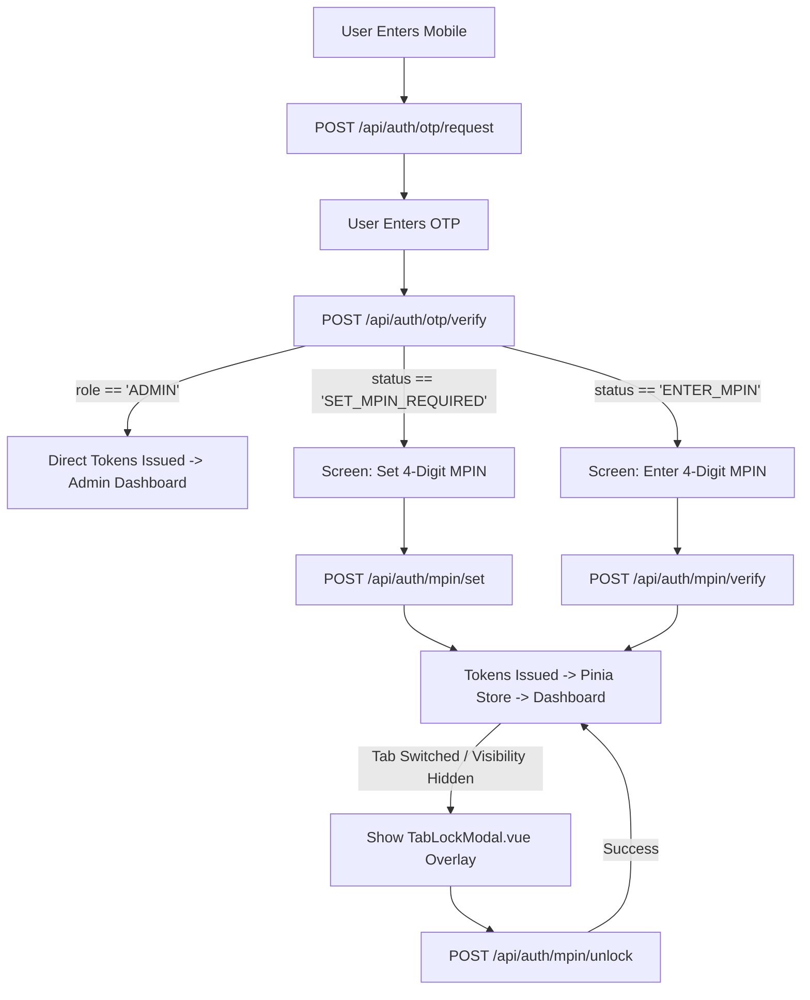

# Vistora Frontend Authentication Integration Guide

> **Target Audience:** Frontend AI Agent / Vue.js 3 Developer  
> **Frontend Stack:** Vue 3 (Composition API `<script setup lang="ts">`) + TanStack Query (`@tanstack/vue-query`) + Pinia + Axios + Vue Router + Tailwind CSS  
> **Backend Base URL:** `http://localhost:5000`  
> **Auth Base Route:** `http://localhost:5000/api/auth`  
> **Default Headers:** `Content-Type: application/json`

---

## 📌 1. Architecture & Design Principles

The Vistora backend implements a **custom OTP + MPIN authentication system** (no passwords):
1. **Identity Proof (OTP):** Mobile number ownership is verified via a 6-digit OTP (5-digit for Admin).
2. **Day-to-Day PIN (MPIN):** Fast 4-digit unlock PIN used for login after OTP verification.
3. **Session Management (JWT):** Short-lived **15-minute Access Token** (sent in `Authorization: Bearer <token>` header) + **7-day Refresh Token** (for silent token rotation).
4. **Soft Tab-Lock:** When a logged-in user switches browser tabs, the frontend locks and displays an MPIN unlock overlay without killing the active session tokens.
5. **Role-Based Access Control (RBAC):** `GUEST`, `HOST`, and `ADMIN`.

---

## 🔑 2. Fixed Development OTPs & Credentials

In development mode, OTPs are fixed and logged to the backend terminal:

| Role | Test Mobile | Dev OTP | MPIN Behavior |
|---|---|---|---|
| **GUEST** | `9811002201` (or self-registered) | `999999` (6 digits) | Sets 4-digit MPIN on first login |
| **HOST** | `9822003301` (or self-registered) | `118899` (6 digits) | Sets 4-digit MPIN on first login |
| **ADMIN** | `9000000000` (pre-seeded) | `55555` (5 digits) | **No MPIN** — direct login on OTP verification |

---

## 🗺️ 3. Complete User Journeys & State Machine



---

## 📡 4. Complete API Specifications

### 4.1 Register (`POST /api/auth/register`)
Creates a new `GUEST` or `HOST` user (`is_verified = false`, `mpin_hash = null`).  
*(Note: Admin cannot self-register).*

- **Endpoint:** `POST /api/auth/register`
- **Request Body:**
```json
{
  "name": "Sameer Guest",
  "email": "sameer.guest@example.com",
  "mobile": "9811002201",
  "role": "GUEST"
}
```
- **Response `201 Created`:**
```json
{
  "message": "User registered successfully",
  "user": {
    "id": 4,
    "name": "Sameer Guest",
    "email": "sameer.guest@example.com",
    "mobile": "9811002201",
    "role": "GUEST",
    "is_verified": false,
    "created_at": "2026-08-23T15:20:00.000Z"
  }
}
```

---

### 4.2 Request OTP (`POST /api/auth/otp/request`)
Triggers OTP dispatch for a mobile number.

- **Endpoint:** `POST /api/auth/otp/request`
- **Request Body:**
```json
{
  "mobile": "9811002201"
}
```
- **Response `200 OK`:**
```json
{
  "message": "OTP sent successfully",
  "otpSent": true,
  "role": "GUEST"
}
```

---

### 4.3 Verify OTP (`POST /api/auth/otp/verify`)
Verifies OTP and marks `is_verified = true`.

- **Endpoint:** `POST /api/auth/otp/verify`
- **Request Body:**
```json
{
  "mobile": "9811002201",
  "otp": "999999"
}
```

#### Case A: First-time Guest / Host (MPIN not set yet)
- **Response `200 OK`:**
```json
{
  "message": "OTP verified successfully",
  "status": "SET_MPIN_REQUIRED",
  "otpTicket": "eyJhbGciOiJIUzI1NiIsInR5cCI6IkpXVCJ9..."
}
```
👉 *Action: Store `otpTicket` and `mobile` in Pinia authStore, navigate to `/set-mpin`.*

#### Case B: Returning Guest / Host (MPIN already set)
- **Response `200 OK`:**
```json
{
  "message": "OTP verified successfully",
  "status": "ENTER_MPIN",
  "otpTicket": "eyJhbGciOiJIUzI1NiIsInR5cCI6IkpXVCJ9..."
}
```
👉 *Action: Store `otpTicket` and `mobile` in Pinia authStore, navigate to `/enter-mpin`.*

#### Case C: Admin (No MPIN required)
- **Response `200 OK`:**
```json
{
  "message": "OTP verified successfully",
  "role": "ADMIN",
  "user": {
    "id": 5,
    "name": "Vistora Admin",
    "email": "admin@vistora.com",
    "mobile": "9000000000",
    "role": "ADMIN",
    "is_verified": true,
    "created_at": "2026-08-23T15:20:00.000Z"
  },
  "accessToken": "eyJhbGciOiJIUzI1NiIsInR5cCI6IkpXVCJ9...",
  "refreshToken": "eyJhbGciOiJIUzI1NiIsInR5cCI6IkpXVCJ9..."
}
```
👉 *Action: Store tokens & user in Pinia authStore, navigate directly to `/admin`.*

---

### 4.4 Set First-Time MPIN (`POST /api/auth/mpin/set`)
Hashes 4-digit MPIN and issues initial Access + Refresh tokens.

- **Endpoint:** `POST /api/auth/mpin/set`
- **Request Body:**
```json
{
  "mobile": "9811002201",
  "otpTicket": "eyJhbGciOiJIUzI1NiIsInR5cCI6IkpXVCJ9...",
  "mpin": "1234"
}
```
- **Response `200 OK`:**
```json
{
  "message": "MPIN set successfully",
  "user": {
    "id": 4,
    "name": "Sameer Guest",
    "email": "sameer.guest@example.com",
    "mobile": "9811002201",
    "role": "GUEST",
    "is_verified": true,
    "created_at": "2026-08-23T15:20:00.000Z"
  },
  "accessToken": "eyJhbGciOiJIUzI1NiIsInR5cCI6IkpXVCJ9...",
  "refreshToken": "eyJhbGciOiJIUzI1NiIsInR5cCI6IkpXVCJ9..."
}
```

---

### 4.5 Returning Login with MPIN (`POST /api/auth/mpin/verify`)
Authenticates returning user via MPIN and issues Access + Refresh tokens.

- **Endpoint:** `POST /api/auth/mpin/verify`
- **Request Body:**
```json
{
  "mobile": "9811002201",
  "otpTicket": "eyJhbGciOiJIUzI1NiIsInR5cCI6IkpXVCJ9...",
  "mpin": "1234"
}
```
- **Response `200 OK`:**
```json
{
  "message": "Login successful",
  "user": {
    "id": 4,
    "name": "Sameer Guest",
    "email": "sameer.guest@example.com",
    "mobile": "9811002201",
    "role": "GUEST",
    "is_verified": true,
    "created_at": "2026-08-23T15:20:00.000Z"
  },
  "accessToken": "eyJhbGciOiJIUzI1NiIsInR5cCI6IkpXVCJ9...",
  "refreshToken": "eyJhbGciOiJIUzI1NiIsInR5cCI6IkpXVCJ9..."
}
```

---

### 4.6 Refresh Access Token (`POST /api/auth/refresh`)
Generates a new 15-minute Access Token when the existing one expires.

- **Endpoint:** `POST /api/auth/refresh`
- **Request Body:**
```json
{
  "refreshToken": "eyJhbGciOiJIUzI1NiIsInR5cCI6IkpXVCJ9..."
}
```
- **Response `200 OK`:**
```json
{
  "message": "Token refreshed successfully",
  "accessToken": "eyJhbGciOiJIUzI1NiIsInR5cCI6IkpXVCJ9..."
}
```

---

### 4.7 MPIN Tab-Lock Unlock (`POST /api/auth/mpin/unlock`)
Unlocks the UI overlay when user returns to the tab. **No new tokens are generated.**

- **Endpoint:** `POST /api/auth/mpin/unlock`
- **Headers:** `Authorization: Bearer <accessToken>`
- **Request Body:**
```json
{
  "mpin": "1234"
}
```
- **Response `200 OK`:**
```json
{
  "message": "Unlocked successfully",
  "unlocked": true
}
```

---

### 4.8 Logout (`POST /api/auth/logout`)
Revokes refresh token from database.

- **Endpoint:** `POST /api/auth/logout`
- **Request Body:**
```json
{
  "refreshToken": "eyJhbGciOiJIUzI1NiIsInR5cCI6IkpXVCJ9..."
}
```
- **Response `200 OK`:**
```json
{
  "message": "Logged out successfully",
  "loggedOut": true
}
```

---

## 💻 5. Frontend Implementation Blueprint (Vue 3 + Pinia + TanStack Query)

### 5.1 Project Setup & Dependencies

```bash
npm create vite@latest vistora-client -- --template vue-ts
cd vistora-client
npm install pinia @tanstack/vue-query axios vue-router
npm install -D tailwindcss @tailwindcss/vite
```

---

### 5.2 TypeScript Types (`src/types/auth.types.ts`)

```typescript
export type Role = 'GUEST' | 'HOST' | 'ADMIN';

export interface User {
  id: number;
  name: string;
  email: string;
  mobile: string;
  role: Role;
  is_verified: boolean;
  created_at: string;
}

export interface RegisterPayload {
  name: string;
  email: string;
  mobile: string;
  role: 'GUEST' | 'HOST';
}

export interface OtpRequestPayload {
  mobile: string;
}

export interface OtpVerifyPayload {
  mobile: string;
  otp: string;
}

export interface OtpVerifyResponse {
  message: string;
  status?: 'SET_MPIN_REQUIRED' | 'ENTER_MPIN';
  otpTicket?: string;
  role?: Role;
  user?: User;
  accessToken?: string;
  refreshToken?: string;
}

export interface MpinPayload {
  mobile: string;
  otpTicket: string;
  mpin: string;
}

export interface AuthSuccessResponse {
  message: string;
  user: User;
  accessToken: string;
  refreshToken: string;
}
```

---

### 5.3 Axios Client with Silent 401 Refresh Interceptor (`src/api/client.ts`)

```typescript
import axios from 'axios';

const api = axios.create({
  baseURL: 'http://localhost:5000/api',
  headers: {
    'Content-Type': 'application/json',
  },
});

// Attach Access Token to outgoing requests
api.interceptors.request.use((config) => {
  const token = localStorage.getItem('accessToken');
  if (token && config.headers) {
    config.headers.Authorization = `Bearer ${token}`;
  }
  return config;
});

// Silent 401 token refresh queue
let isRefreshing = false;
let failedQueue: Array<{
  resolve: (token: string) => void;
  reject: (err: unknown) => void;
}> = [];

const processQueue = (error: unknown, token: string | null = null) => {
  failedQueue.forEach((prom) => {
    if (error) prom.reject(error);
    else if (token) prom.resolve(token);
  });
  failedQueue = [];
};

api.interceptors.response.use(
  (response) => response,
  async (error) => {
    const originalRequest = error.config;

    if (error.response?.status === 401 && !originalRequest._retry) {
      if (originalRequest.url === '/auth/refresh') {
        localStorage.clear();
        window.location.href = '/login';
        return Promise.reject(error);
      }

      if (isRefreshing) {
        return new Promise<string>((resolve, reject) => {
          failedQueue.push({ resolve, reject });
        })
          .then((token) => {
            originalRequest.headers.Authorization = `Bearer ${token}`;
            return api(originalRequest);
          })
          .catch((err) => Promise.reject(err));
      }

      originalRequest._retry = true;
      isRefreshing = true;

      const refreshToken = localStorage.getItem('refreshToken');
      if (!refreshToken) {
        localStorage.clear();
        window.location.href = '/login';
        return Promise.reject(error);
      }

      try {
        const { data } = await axios.post('http://localhost:5000/api/auth/refresh', {
          refreshToken,
        });

        const newAccessToken = data.accessToken;
        localStorage.setItem('accessToken', newAccessToken);
        api.defaults.headers.common['Authorization'] = `Bearer ${newAccessToken}`;

        processQueue(null, newAccessToken);
        return api(originalRequest);
      } catch (refreshErr) {
        processQueue(refreshErr, null);
        localStorage.clear();
        window.location.href = '/login';
        return Promise.reject(refreshErr);
      } finally {
        isRefreshing = false;
      }
    }

    return Promise.reject(error);
  }
);

export default api;
```

---

### 5.4 Pinia Auth Store (`src/stores/auth.store.ts`)

Pinia manages client session state (user, tokens, tab-lock, temporary OTP ticket).

```typescript
import { defineStore } from 'pinia';
import { ref, computed } from 'vue';
import type { User, Role } from '../types/auth.types';

export const useAuthStore = defineStore('auth', () => {
  // State
  const user = ref<User | null>(
    localStorage.getItem('user') ? JSON.parse(localStorage.getItem('user')!) : null
  );
  const accessToken = ref<string | null>(localStorage.getItem('accessToken'));
  const refreshToken = ref<string | null>(localStorage.getItem('refreshToken'));

  // Intermediate state for OTP -> MPIN flow
  const pendingMobile = ref<string>('');
  const pendingOtpTicket = ref<string>('');

  // Soft tab-lock state (in memory only)
  const isLocked = ref<boolean>(false);

  // Getters
  const isAuthenticated = computed(() => !!accessToken.value && !!user.value);
  const userRole = computed<Role | undefined>(() => user.value?.role);

  // Actions
  function setSession(newUser: User, newAccess: string, newRefresh: string) {
    user.value = newUser;
    accessToken.value = newAccess;
    refreshToken.value = newRefresh;
    isLocked.value = false;

    localStorage.setItem('user', JSON.stringify(newUser));
    localStorage.setItem('accessToken', newAccess);
    localStorage.setItem('refreshToken', newRefresh);

    // Clear temporary pending ticket
    pendingMobile.value = '';
    pendingOtpTicket.value = '';
  }

  function setPendingOtp(mobile: string, otpTicket: string) {
    pendingMobile.value = mobile;
    pendingOtpTicket.value = otpTicket;
  }

  function lockTab() {
    // Only lock authenticated Guests and Hosts (Admin has no MPIN)
    if (isAuthenticated.value && userRole.value !== 'ADMIN') {
      isLocked.value = true;
    }
  }

  function unlockTab() {
    isLocked.value = false;
  }

  function clearSession() {
    user.value = null;
    accessToken.value = null;
    refreshToken.value = null;
    pendingMobile.value = '';
    pendingOtpTicket.value = '';
    isLocked.value = false;

    localStorage.removeItem('user');
    localStorage.removeItem('accessToken');
    localStorage.removeItem('refreshToken');
  }

  return {
    user,
    accessToken,
    refreshToken,
    pendingMobile,
    pendingOtpTicket,
    isLocked,
    isAuthenticated,
    userRole,
    setSession,
    setPendingOtp,
    lockTab,
    unlockTab,
    clearSession,
  };
});
```

---

### 5.5 TanStack Vue Query Auth Mutations (`src/composables/useAuthMutations.ts`)

TanStack Query (`@tanstack/vue-query`) handles all async server state mutations, loading states, and error handling cleanly.

```typescript
import { useMutation } from '@tanstack/vue-query';
import { useRouter } from 'vue-router';
import api from '../api/client';
import { useAuthStore } from '../stores/auth.store';
import type {
  RegisterPayload,
  OtpRequestPayload,
  OtpVerifyPayload,
  OtpVerifyResponse,
  MpinPayload,
  AuthSuccessResponse,
} from '../types/auth.types';

export function useAuthMutations() {
  const router = useRouter();
  const authStore = useAuthStore();

  // 1. Register Mutation
  const registerMutation = useMutation({
    mutationFn: async (payload: RegisterPayload) => {
      const { data } = await api.post('/auth/register', payload);
      return data;
    },
    onSuccess: (_, variables) => {
      authStore.pendingMobile = variables.mobile;
      router.push('/login');
    },
  });

  // 2. Request OTP Mutation
  const requestOtpMutation = useMutation({
    mutationFn: async (payload: OtpRequestPayload) => {
      const { data } = await api.post('/auth/otp/request', payload);
      return data;
    },
  });

  // 3. Verify OTP Mutation
  const verifyOtpMutation = useMutation({
    mutationFn: async (payload: OtpVerifyPayload): Promise<OtpVerifyResponse> => {
      const { data } = await api.post('/auth/otp/verify', payload);
      return data;
    },
    onSuccess: (data, variables) => {
      // Admin bypasses MPIN directly
      if (data.role === 'ADMIN' && data.user && data.accessToken && data.refreshToken) {
        authStore.setSession(data.user, data.accessToken, data.refreshToken);
        router.push('/admin');
        return;
      }

      // Guest / Host navigation
      if (data.otpTicket) {
        authStore.setPendingOtp(variables.mobile, data.otpTicket);
        if (data.status === 'SET_MPIN_REQUIRED') {
          router.push('/set-mpin');
        } else {
          router.push('/enter-mpin');
        }
      }
    },
  });

  // 4. Set First-time MPIN Mutation
  const setMpinMutation = useMutation({
    mutationFn: async (payload: MpinPayload): Promise<AuthSuccessResponse> => {
      const { data } = await api.post('/auth/mpin/set', payload);
      return data;
    },
    onSuccess: (data) => {
      authStore.setSession(data.user, data.accessToken, data.refreshToken);
      router.push(data.user.role === 'HOST' ? '/host/dashboard' : '/explore');
    },
  });

  // 5. Verify MPIN Mutation
  const verifyMpinMutation = useMutation({
    mutationFn: async (payload: MpinPayload): Promise<AuthSuccessResponse> => {
      const { data } = await api.post('/auth/mpin/verify', payload);
      return data;
    },
    onSuccess: (data) => {
      authStore.setSession(data.user, data.accessToken, data.refreshToken);
      router.push(data.user.role === 'HOST' ? '/host/dashboard' : '/explore');
    },
  });

  // 6. MPIN Tab-Unlock Mutation
  const unlockMpinMutation = useMutation({
    mutationFn: async (mpin: string) => {
      const { data } = await api.post('/auth/mpin/unlock', { mpin });
      return data;
    },
    onSuccess: () => {
      authStore.unlockTab();
    },
  });

  // 7. Logout Mutation
  const logoutMutation = useMutation({
    mutationFn: async () => {
      const refreshToken = authStore.refreshToken;
      await api.post('/auth/logout', { refreshToken });
    },
    onSettled: () => {
      authStore.clearSession();
      router.push('/login');
    },
  });

  return {
    registerMutation,
    requestOtpMutation,
    verifyOtpMutation,
    setMpinMutation,
    verifyMpinMutation,
    unlockMpinMutation,
    logoutMutation,
  };
}
```

---

### 5.6 Tab-Lock Composable (`src/composables/useTabLock.ts`)

Listens to browser tab visibility and locks the screen without invalidating JWT tokens.

```typescript
import { onMounted, onUnmounted, ref } from 'vue';
import { useAuthStore } from '../stores/auth.store';

export function useTabLock() {
  const authStore = useAuthStore();
  const wasHidden = ref(false);

  const handleVisibilityChange = () => {
    if (document.visibilityState === 'hidden') {
      wasHidden.value = true;
    } else if (document.visibilityState === 'visible' && wasHidden.value) {
      authStore.lockTab();
      wasHidden.value = false;
    }
  };

  onMounted(() => {
    document.addEventListener('visibilitychange', handleVisibilityChange);
  });

  onUnmounted(() => {
    document.removeEventListener('visibilitychange', handleVisibilityChange);
  });
}
```

---

### 5.7 Tab-Lock Screen Overlay Component (`src/components/TabLockModal.vue`)

Full-screen overlay rendered conditionally when `authStore.isLocked` is `true`.

```vue
<template>
  <div class="fixed inset-0 z-50 flex items-center justify-center bg-black/80 backdrop-blur-md">
    <div class="w-full max-w-sm rounded-2xl bg-white p-6 shadow-2xl text-center">
      <div class="text-4xl mb-2">🔒</div>
      <h2 class="text-xl font-bold text-gray-900">Screen Locked</h2>
      <p class="mt-1 text-sm text-gray-500">Enter your 4-digit MPIN to resume session</p>

      <form @submit.prevent="handleUnlock" class="mt-6">
        <input
          type="password"
          maxlength="4"
          v-model="mpin"
          @input="onMpinInput"
          class="w-40 text-center tracking-[1em] text-2xl font-bold border-2 border-gray-300 rounded-lg p-2 focus:border-blue-600 focus:outline-none"
          placeholder="••••"
          autofocus
        />

        <p v-if="errorMessage" class="mt-2 text-sm text-red-600 font-medium">
          {{ errorMessage }}
        </p>

        <button
          type="submit"
          :disabled="unlockMpinMutation.isPending.value || mpin.length !== 4"
          class="mt-6 w-full rounded-lg bg-blue-600 py-2.5 font-semibold text-white hover:bg-blue-700 disabled:opacity-50 transition"
        >
          {{ unlockMpinMutation.isPending.value ? 'Unlocking...' : 'Unlock' }}
        </button>
      </form>

      <button
        type="button"
        @click="handleLogout"
        class="mt-4 text-xs text-gray-400 hover:text-red-500 underline"
      >
        Log out instead
      </button>
    </div>
  </div>
</template>

<script setup lang="ts">
import { ref } from 'vue';
import { useAuthMutations } from '../composables/useAuthMutations';

const mpin = ref('');
const errorMessage = ref('');
const { unlockMpinMutation, logoutMutation } = useAuthMutations();

function onMpinInput(e: Event) {
  const target = e.target as HTMLInputElement;
  mpin.value = target.value.replace(/\D/g, '');
}

async function handleUnlock() {
  if (mpin.value.length !== 4) {
    errorMessage.value = 'Please enter your 4-digit MPIN';
    return;
  }

  errorMessage.value = '';
  try {
    await unlockMpinMutation.mutateAsync(mpin.value);
    mpin.value = '';
  } catch (err: any) {
    errorMessage.value = err.response?.data?.message || 'Invalid MPIN';
  }
}

function handleLogout() {
  logoutMutation.mutate();
}
</script>
```

---

### 5.8 Root Application Setup (`src/App.vue` & `src/main.ts`)

#### `src/main.ts`
```typescript
import { createApp } from 'vue';
import { createPinia } from 'pinia';
import { VueQueryPlugin } from '@tanstack/vue-query';
import App from './App.vue';
import router from './router';
import './style.css';

const app = createApp(App);
const pinia = createPinia();

app.use(pinia);
app.use(VueQueryPlugin);
app.use(router);

app.mount('#app');
```

#### `src/App.vue`
```vue
<template>
  <div id="app" class="min-h-screen bg-gray-50 text-gray-900">
    <router-view />
    <!-- Global Tab-Lock Overlay -->
    <TabLockModal v-if="authStore.isLocked" />
  </div>
</template>

<script setup lang="ts">
import { useAuthStore } from './stores/auth.store';
import { useTabLock } from './composables/useTabLock';
import TabLockModal from './components/TabLockModal.vue';

const authStore = useAuthStore();

// Mount tab-lock listener globally
useTabLock();
</script>
```

---

## 🎯 6. Error Handling & Response Format

All backend errors return standard JSON with HTTP status codes:
```json
{
  "message": "Error description string"
}
```
Validation errors (`400 Bad Request`) return:
```json
{
  "message": "Validation failed",
  "errors": [
    { "field": "mobile", "message": "Mobile must contain 10 to 15 digits" },
    { "field": "mpin", "message": "MPIN must contain exactly 4 digits" }
  ]
}
```

---

## 🚀 7. Summary of the Vue 3 + Pinia + Vue Query Architecture

- **Pinia** holds client session state: `user`, `accessToken`, `refreshToken`, `isLocked`, and `pendingOtpTicket`.
- **TanStack Vue Query** manages server asynchronous requests: `useMutation` for register, OTP, MPIN, and unlock actions.
- **Axios Interceptor** automatically refreshes expired access tokens in the background without user intervention.
- **Vue Composable `useTabLock()`** monitors `document.visibilitychange` and triggers Pinia's `lockTab()` to display `TabLockModal.vue`.
